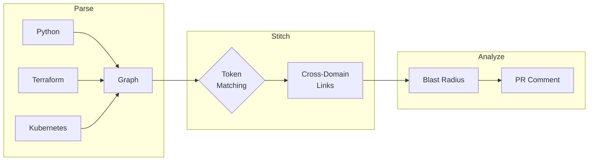

---
hide:
  - navigation
  - toc
---

# Junkan

**Catch cross-domain breaking changes before they reach production.**

## Why Junkan?

<div class="grid cards" markdown>

-   :material-alert-circle:{ .lg .middle } **The Problem**

    ---

    Rename a Terraform variable? `terraform plan` succeeds, but your Python app crashes on deploy. CI checks domains in isolation — nobody checks across them.

-   :material-check-circle:{ .lg .middle } **The Solution**

    ---

    Junkan builds a unified dependency graph across Python, Terraform, Kubernetes, and dbt. See what breaks before you merge.

</div>

## How It Works



1. **Parse** your codebase into a dependency graph
2. **Stitch** cross-domain links using token matching
3. **Analyze** blast radius for any change

## Quick Start

<div class="grid cards" markdown>

-   **1. Install**

    ---

    ```bash
    pip install junkan
    ```

-   **2. Scan**

    ---

    ```bash
    junkan init
    junkan scan
    ```

-   **3. Analyze**

    ---

    ```bash
    junkan blast-radius env:DATABASE_URL
    ```

</div>

## Features

<div class="grid cards" markdown>

-   :material-clock-fast:{ .lg .middle } **5-Minute Setup**

    ---

    Install and scan your first project in minutes. No configuration required.

    [:octicons-arrow-right-24: Quickstart](getting-started/quickstart.md)

-   :material-graph:{ .lg .middle } **Understand Impact**

    ---

    See what breaks when you change infrastructure or code. Traverse dependencies across domains.

    [:octicons-arrow-right-24: Blast Radius](explanation/concepts/blast-radius.md)

-   :material-github:{ .lg .middle } **CI/CD Ready**

    ---

    Block risky PRs automatically with GitHub Actions. Get impact analysis on every pull request.

    [:octicons-arrow-right-24: CI Integration](getting-started/first-ci-integration.md)

-   :material-cog:{ .lg .middle } **Highly Configurable**

    ---

    Tune confidence thresholds and suppress false positives. Make it work for your codebase.

    [:octicons-arrow-right-24: Configuration](reference/configuration/junkan-yaml.md)

</div>

## Supported Stacks

| Language/Tool | Patterns Detected |
|---------------|-------------------|
| **Python** | `os.getenv`, Pydantic Settings, Click/Typer, django-environ |
| **Terraform** | Resources, variables, outputs, data sources |
| **Kubernetes** | ConfigMaps, Secrets, environment variables |
| **dbt** | `ref()`, `source()`, `var()` |
| **JavaScript** | `process.env`, dotenv |

## Get Started

<div class="grid cards" markdown>

-   :material-download:{ .lg .middle } **Install**

    ---

    [:octicons-arrow-right-24: Installation Guide](getting-started/installation.md)

-   :material-rocket-launch:{ .lg .middle } **Quickstart**

    ---

    [:octicons-arrow-right-24: 5-Minute Tutorial](getting-started/quickstart.md)

-   :material-book-open:{ .lg .middle } **Learn**

    ---

    [:octicons-arrow-right-24: Full Tutorials](tutorials/index.md)

</div>