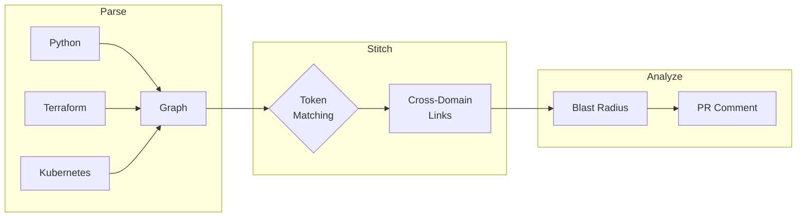

---
hide:
  - navigation
  - toc
---

# Jnkn

**Catch cross-domain breaking changes before they reach production.**

<div class="grid cards" markdown>

-   :material-clock-fast:{ .lg .middle } __5-Minute Setup__

    ---

    Install and scan your first project in minutes.

    [:octicons-arrow-right-24: Quickstart](getting-started/quickstart.md)

-   :material-graph:{ .lg .middle } __Understand Impact__

    ---

    See what breaks when you change infrastructure or code.

    [:octicons-arrow-right-24: Blast Radius](explanation/concepts/blast-radius.md)

-   :material-github:{ .lg .middle } __CI/CD Ready__

    ---

    Block risky PRs automatically with GitHub Actions.

    [:octicons-arrow-right-24: CI Integration](getting-started/first-ci-integration.md)

-   :material-cog:{ .lg .middle } __Highly Configurable__

    ---

    Tune confidence thresholds and suppress false positives.

    [:octicons-arrow-right-24: Configuration](reference/configuration/jnkn-yaml.md)

</div>

---

## The Problem

Most CI/CD tools check within their domain. None check **across** domains:

| Change | What CI Checks | What CI Misses |
|--------|----------------|----------------|
| Rename Terraform variable | `terraform plan` succeeds | Python app crashes on deploy |
| Delete dbt column | dbt tests pass | API returns 500 errors |
| Rotate K8s secret name | Manifest validates | Pods fail to start |

**Jnkn catches the gaps.**

---

## How It Works



1. **Parse** your codebase into a dependency graph
2. **Stitch** cross-domain links using token matching
3. **Analyze** blast radius for any change

---

## Quick Example

```bash
# Install
pip install jnkn

# Scan your project
jnkn scan --dir .

# Check what breaks if DATABASE_URL changes
jnkn blast-radius env:DATABASE_URL
```

```json
{
  "source": "env:DATABASE_URL",
  "impacted": [
    "file://src/db/connection.py",
    "file://src/api/users.py",
    "infra:aws_db_instance.main"
  ],
  "total_impacted": 3
}
```

---

## Supported Stacks

| Language/Tool | Patterns Detected |
|---------------|-------------------|
| **Python** | `os.getenv`, Pydantic Settings, Click/Typer, django-environ |
| **Terraform** | Resources, variables, outputs, data sources |
| **Kubernetes** | ConfigMaps, Secrets, environment variables |
| **dbt** | `ref()`, `source()`, `var()` |
| **JavaScript** | `process.env`, dotenv |

---

## Get Started

<div class="grid cards" markdown>

-   [:octicons-download-24: __Install Jnkn__](getting-started/installation.md)
-   [:octicons-rocket-24: __5-Minute Quickstart__](getting-started/quickstart.md)
-   [:octicons-book-24: __Read the Tutorials__](tutorials/index.md)

</div>
